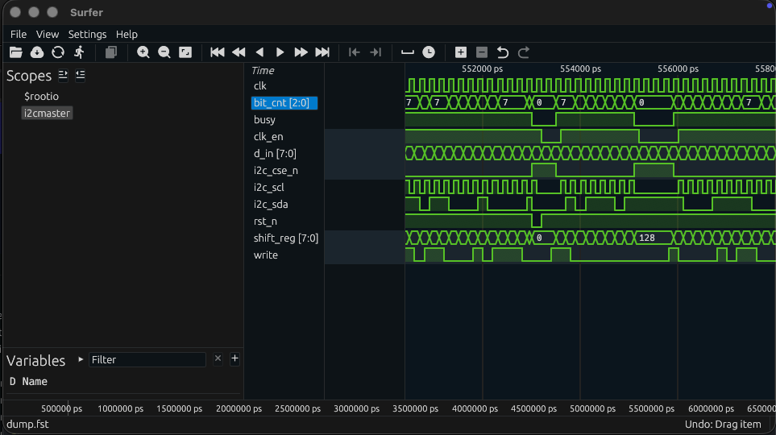

# Electrical Testing FPGA Control System

This repo contains the RTL database to synthesize a finite state machine controller to program and readout digital samples from the developed 28nm TSMC Ultraosund Compressive Multiplexing Analog Frontend. 

## Contents


### 1. Hello, World!

An example `Hello World` LED blink RTL project can be found in [`hello_world_arty_s7`](hello_world_arty_s7) directory. The project contains a LED driver system with the associated `constraints` files to synthesize within a Digilent Arty S7 FPGA.

### 2. State Machine Controller

The actual RTL, associated `python-cocotb`-based testbenches, and test-generated `.fst` waveforms for the electrical testing FPGA control system are located in the [`src`](src) directory, in which each subblock is located in its dedicated sub-directory.

### 3. Running Tests

The RTL testing outputs are not version-controlled with this repository. To generate, tests have to be re-run. For now, to test each sub-system individually, navigate to the intended subblock's testing directory, and run the `Makefile` script located in each `tests` sub-directory of the block.

**Example**:
Navigate from this repo's root:
```shell
cd src/i2cmaster/tests
```
Run the tests:
```shell
make
```
Visualize resulting waveforms using [`Surfer`](https://surfer-project.org/):
```shell
surfer dump.fst &
```
